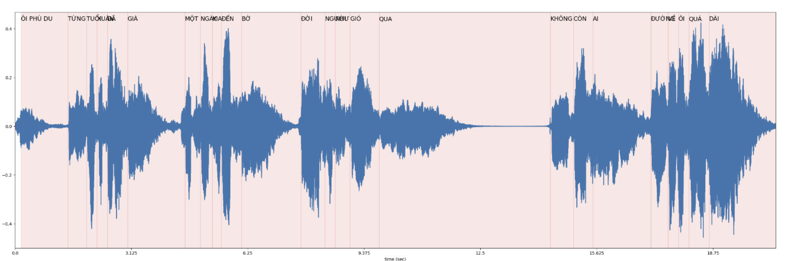

# Solution for Zalo AI Challenge 2022 - Lyrics Alignment
<p align="center">
    
</p>

## Requirements

`pip install -r requirements.txt`


## Overview

0. Using Demucs to extract the music and lyrics in the original audio.
1. Resampling original audio to 16K audio.
2. Creating new vocab dictionary for Wav2Vec2.
3. Selecting segments from labels randomly and merge them to create new pair of audio/lyric.
4. Fine-tuning Wav2Vec2 model with original CTC loss with all training data with the new vocab dictionary.
5. Using forced-alignment (dynamic programming) to find the best alignment path between audio and lyric.
6. Merging character durations to obtain words segment index from the audio.


## Reproduce

### Prepare Dataset
Download data [here](https://challenge.zalo.ai/portal/lyric-alignment) and prepare a dataset in the following format:

```
|- data/
|   |- public_test/
|       |- lyrics/
|       |- new_labels_json/
|       |- songs/
|   |- train/
|       |- labels/
|       |- songs/
```

### Training
`sh reproduce.sh`

you can also download, extract our checkpoints [here](https://drive.google.com/file/d/1KI4Xetv_tRHOB6Q0zIK0Z_ZBqUb9t_41/view?usp=sharing) and will obtain the following format:

```
|- checkpoints/
|   |- dragonSwing/
|       |- wav2vec2-base-vietnamese/
|           |- checkpoint-5500/
|               |- pytorch_model.bin
```

### Make A Submission

```
python submission.py submission --saved_path ./result
zip -r submit.zip result/*.json
```
